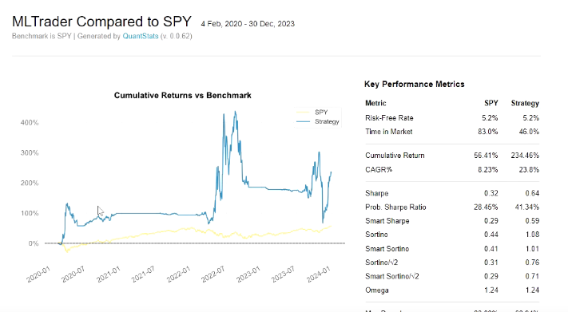

# AI_Tradebot

This repository contains files pertaining to a news sentiment analysis-based AI Paper Trading Bot.

---



---

## Steps

1. **Create a virtual environment and install all dependencies:**
    ```bash
    pip install -r requirements.txt
    ```

---

2. **Run the script `tradeBot.py` in the terminal:**
    ```bash
    python tradeBot.py
    ```

---

